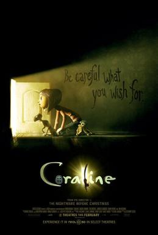
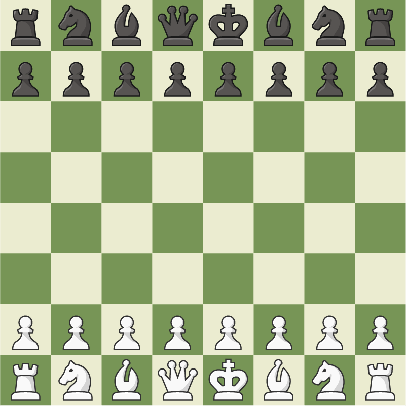

# Summer 2024 -- Angelica

## **Intro:**
My name is Angelica and I am in 10th grade. I have one dog and I love food. I also enjoy playing chess. I love doing hair, especially braiding hair.
## Summer Activities:
I hung out with my friends over the summer and had a picnic. I also went to the ocean and swam many times. The food afterwards at a restaurant nearby tasted so good. In addition, I went to my cousin's house and swam a lot. Lastly, I went to summer school and made bracelets with my friends.
## Favorite Movie:
My favorite movie is Coraline and I just recently rewatched it over the summer. It was really good and it is very nostalgic for me because I watched it as a kid.
[Coraline](https://en.wikipedia.org/wiki/Coraline_(film))

## New Skill Learned:
I learned how to play chess because my friend wanted to play with me. I got really competitive and wanted to beat her, so I started playing a lot. I realized it was fun so I started playing it everyday.
[chess.com](https://www.chess.com/play)

## Favorite Summer Food:
My favorite summer food is watermelon with cheese bread because I used to eat it every day during summer as a kid and it is nostalgic for me.

## Fun Fact About Myself:
I was in percussion for three years at my middle school and I went to many competitions. I also played in front of many different audiences.
